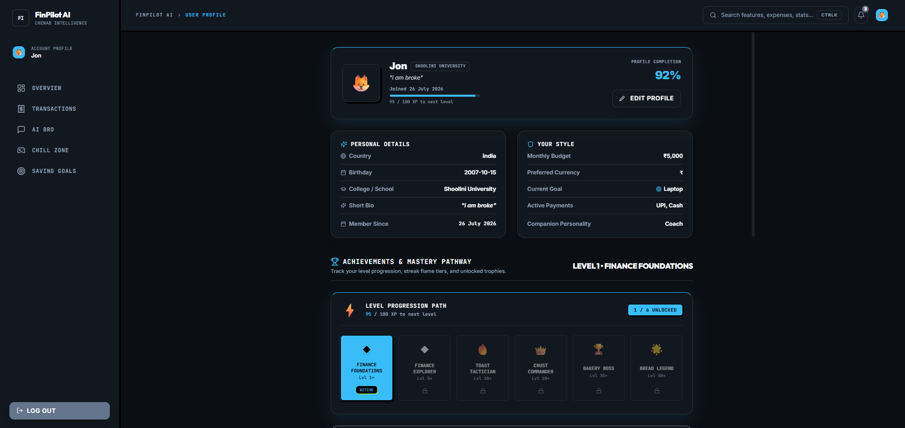
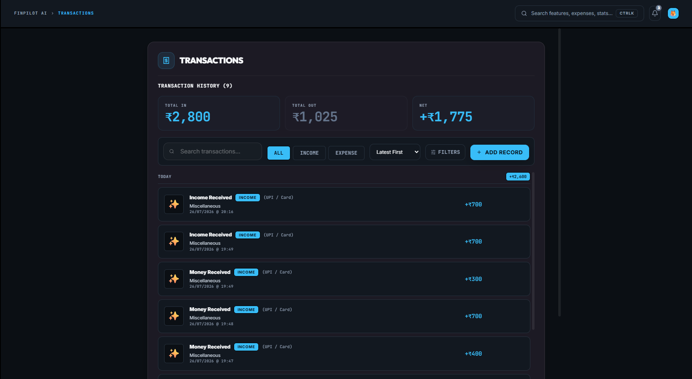
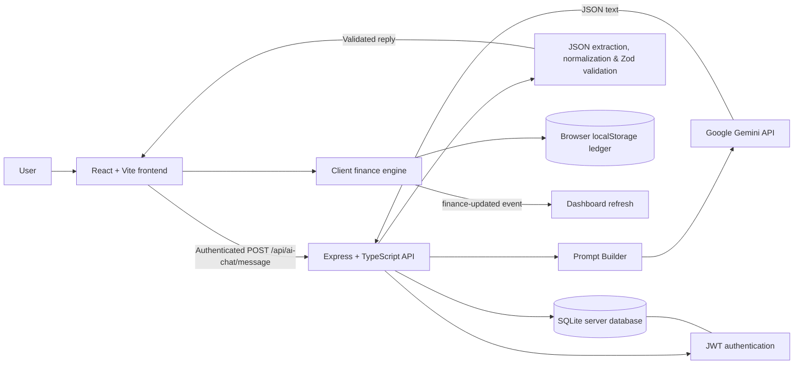
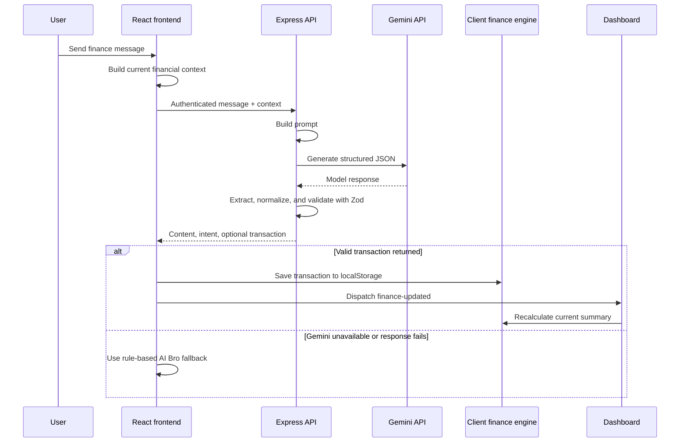

# FinPilot AI

**FinPilot AI** is a personal-finance dashboard for students, built by **Chenab Intelligence**. It brings budgeting, transaction tracking, saving goals, recurring-subscription tracking, and a conversational financial companion into one local-first web experience.

## Team

**Chenab Intelligence**

## Project Overview

Students often manage a limited monthly allowance across food, travel, shopping, bills, and savings goals, but recording every transaction manually is easy to postpone. FinPilot AI makes that information visible through a dashboard and lets users describe completed transactions in natural language.

AI is used to turn a user message and a compact snapshot of their real in-app financial context into a structured response. The assistant can answer budgeting questions and, for completed transactions, return a validated transaction payload that the existing finance engine records. It is a budgeting companion, not an investment, tax, or legal adviser.

## Features

- Authenticated accounts with profile, currency, and monthly-allowance settings.
- Manual income and expense logging with categories and recent-transaction views.
- Budget summary with remaining balance, category totals, daily spending data, and spending visualizations.
- AI Bro financial companion powered by Google Gemini when configured, with selectable response personalities.
- Natural-language logging of completed income and expense transactions.
- Context-aware spending summaries and affordability questions based on the current cycle's allowance and transactions.
- Savings goals with deposits, progress tracking, completion, and archiving.
- Subscription tracking with monthly totals and active/paused status.
- Local financial insights, spending patterns, notifications, streaks, and progression features.
- Local data backup and restore from Settings.

## Screenshots

### Dashboard



### AI Chat


### Expense Tracking



## AI Architecture

FinPilot AI sends only a compact, current context snapshot to the AI route: currency, allowance, spent and remaining amounts, category totals, up to ten recent transactions, active goals, subscription total, streak state, and selected personality.

1. **Prompt generation** — `promptBuilder.ts` combines the selected voice, financial context, strict intent list, allowed transaction categories, transaction rules, and example prompts into a system and user prompt.
2. **LLM response** — the Express API calls the Google Gemini `generateContent` endpoint with JSON response MIME type.
3. **Structured JSON extraction** — the backend removes common Markdown fences and surrounding whitespace, extracts the JSON-object portion, and parses it.
4. **Validation and normalization** — the route normalizes minor whitespace/case variations, safely defaults a missing non-transaction `intent` to `general`, and validates the result with Zod. The required response fields are `content`, `intent`, and an optional validated `transaction`.
5. **Transaction persistence** — when a validated response has a transaction, the React chat screen passes it to the existing client-side finance engine. The finance repository stores the ledger in browser `localStorage`.
6. **Automatic dashboard refresh** — after saving, the client emits `finance-updated`; the dashboard listens for that existing event and recalculates its summary and dependent views.
7. **Fallback behaviour** — if Gemini is unavailable, the API returns a clean failure response and the client uses its existing rule-based `aiBroEngine` reply path, so chat remains available.

> **Storage note:** SQLite is used by the Express backend for server-side routes such as users, authentication, expenses, chat messages, and goals. The current dashboard ledger used by the finance engine—including transactions returned from AI chat—is browser-local `localStorage`. This distinction reflects the current implementation.



## Core Tech Stack

| Area | Technologies verified in this repository |
| --- | --- |
| Frontend | React 18, TypeScript, Vite, React Router |
| UI and charts | Tailwind CSS, Recharts, Lucide React, Framer Motion |
| Backend | Node.js, Express, TypeScript |
| Server database | SQLite through Node's built-in `node:sqlite` API |
| AI | Google Gemini REST API |
| Validation | Zod |
| Authentication | JWT and bcryptjs |
| Local client data | Browser `localStorage` through repository/engine modules |

## System Architecture



## Project Structure

```text
.
├── client/
│   ├── src/
│   │   ├── components/       # Dashboard shell and reusable UI primitives
│   │   ├── features/         # Auth, dashboard, chat, ledger, goals, settings, and more
│   │   ├── lib/              # Finance, AI context, fallback assistant, and domain engines
│   │   ├── repositories/     # Browser-storage data access adapters
│   │   └── engines/          # Streak, XP, and progression logic
│   └── package.json          # Vite/React client scripts and dependencies
├── server/
│   ├── src/
│   │   ├── ai/               # Gemini client and prompt builder
│   │   ├── db/               # SQLite initialization and schema
│   │   ├── middleware/       # JWT authentication middleware
│   │   └── routes/           # Auth, expenses, goals, chat, and AI-chat APIs
│   ├── .env.example          # Server environment-variable template
│   └── package.json          # Express server scripts and dependencies
├── HANDOFF.md                # Engineering handoff notes
└── README.md                 # Project and setup documentation
```

## Local Setup

### Prerequisites

- Node.js **22.5.0 or later** (the backend uses Node's built-in `node:sqlite` module).
- npm.
- A Google Gemini API key for live Gemini replies. The app still provides the local rule-based AI fallback when no key is configured.

### Installation

From the project root:

```bash
npm install
cd server
npm install
cd ../client
npm install
cd ..
```

Alternatively, install all workspace dependencies with:

```bash
npm run install:all
```

### Environment Variables

Create `server/.env` by copying `server/.env.example`, then supply your local values:

```env
# Either PORT or BREADBUDDY_PORT is accepted by the current server.
PORT=4000
# BREADBUDDY_PORT=4000
CORS_ORIGIN=http://localhost:5173

GEMINI_API_KEY=
GEMINI_MODEL=gemini-flash-latest
JWT_SECRET=replace-with-a-long-random-secret

# Optional: choose a custom SQLite database file.
# DATABASE_PATH=./data/breadbuddy.db
```

`GEMINI_API_KEY` is optional for local exploration: without it, the AI endpoint reports that Gemini is unavailable and the frontend uses the rule-based fallback assistant.

### Run Locally

```bash
npm run dev
```

Expected local URLs:

- Client: `http://localhost:5173`
- Server health check: `http://localhost:4000/api/health`

For a production build:

```bash
npm run build
npm start
```

## Demo

### Live Demo / Build

No public deployment is currently available. The application can be run locally using the setup instructions above.

- **Demo Video:** _Add demo video link here_
- **GitHub Repository:** _Add repository link here_

## Example Prompts

Try these messages in AI Bro after signing in:

- `I bought groceries for ₹1250.`
- `I received my salary of ₹45000.`
- `How much can I spend?`
- `Can I afford a gaming laptop?`

## Future Improvements

The following are future ideas, not claims about the current implementation:

- Persist the client-side finance ledger and related local data to a server-backed, cross-device store.
- Add a hosted deployment, public repository URL, and demo video.
- Add automated tests for AI prompt, parser, validation, and end-to-end finance flows.
- Add richer import/export options and optional financial-data integrations.

## License

This project is distributed under the MIT license, as declared in the root `package.json`.
